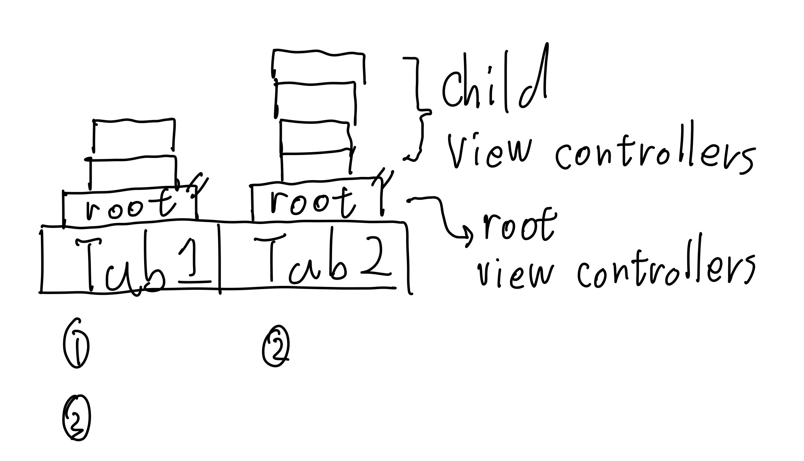

# swift-photoframe

## Step1 : 프로젝트 생성하기

- [x] TabBar Controller를 추가하고 Initial ViewController로 지정한다.
- [x] TabBarController에 Tab을 2개로 지정하고, Scene을 각각 연결한다.
- [x] 두 개 Scene 중에 첫 번째 Scene에 Custom Class를 ViewController로 지정한다.
- [x] 자동 생성된 ViewController 클래스 `viewDidLoad()` 함수에서 `print(#file, #line, #function, #column)` 코드를 추가하고 실행하면 콘솔 영역에 무엇이 출력되는지 확인한다.

### 실습 과정
   

기본 스토리보드로 주어지는 Main.storyboard 에서는 UIKit에 정의된 UIViewController가 위치하여 있고, 이 ViewController의 속성 중 `isInitialViewController`가 체크되어 있다.      
이는 왼쪽에 우향 화살표를 통해 알 수 있다.   

   
보시다시피 `isInitialViewController`의 체크를 해제하면 왼쪽 화살표가 없어진다. initialViewController가 없어진 프로젝트를 실행하면 오류가 발생한다.

과제 수행을 위해 모든 요소들을 다 제거한다. `Command`+`A`로 모두 선택하거나 드래그 앤 드롭으로 모두 선택 후 `Backspace`를 이용하여 요소들을 전부 제거한다.   
   
여기서, `Command`+`Shift`+`L` 혹은 우측 상단의 `+` 버튼을 이용하여 라이브러리 창을 호출한다.   
   
UITabBarController 추가를 위해 TabBar 등을 입력한다. 개인적으로는 클래스 이름 그대로 적는 것을 선호한다. 이 편이 좀 더 정확한 결과를 유도하는 것 같아 선호한다.   
엔터 키를 누르거나 선택된 리스트를 그대로 드래그 앤 드롭으로 스토리보드 화면에 드롭한다.   
   
`isInitialViewController`가 없으므로, 맨 처음 TabBarController의 `Attribute Inspector`창을 확인한다.   
   
실습을 위해 미리 주어진 두 개의 뷰컨트롤러를 모두 삭제한다. 하지만, TabBarController는 남았으므로 UIViewController를 스토리보드에 추가한 뒤 새로 연결하도록 한다.   
   
아까 UITabBarController때처럼 Library를 열어 UIViewController를 검색한다. 같은 방법으로 두 개의 UIViewController를 추가한다.
   
UITabBarController의 맨 위 검은 바 부분의 첫번째 버튼에서 `Control`+Drag 를 이용하여 두 개의 UIViewController를 연결한다. UITabBarController의 하위 관계이므로, `view controllers`를 선택해준다.   

   
   
이제 첫번째 뷰컨트롤러를 위한 CustomClass를 생성한다. `Commans`+`n`을 입력하여 iOS 플랫폼의 `Cocoa Touch Class`를 찾아 Next를 클릭하거나 Enter를 입력한다.      
자동완성을 이용해본다. Class 이름은 'FirstSceneViewController'로 할 예정이다. 우선 클래스 이름을 입력하는 부분에 'FirstScene'을 입력한 후 아래 `Subclass of:` 부분에 UIViewController를 입력한다(자동완성을 지원한다).      
UIViewController가 입력되는 순간 'FirstScene' 뒤에 'ViewController'가 따라 붙는다. Next를 클릭하거나 Enter를 누르고 프로젝트 폴더 안에 클래스 코드를 담을 swift파일을 저장한다.
   
FirstSceneViewController가 바로 보이게 되었다. 주어진 코드를 입력한다.   
   
다시 스토리보드로 돌아가서 `Identity Inspector` 화면의 Custom Class 부분이 비어있다. FirstSceneViewController를 자동완성으로 입력하거나, 수동으로 입력한 후 아래의 모듈을 PhotoFrame으로 맞춘다.   
다른 뷰 컨트롤러로 갔다가 다시 돌아와 적용이 잘 되었는지 다시 확인한 후 실행해본다.   
   
원하는 결과를 얻을 수 있었다.

### GitHub Push Error Alert!

GitHub `Push` 시 다음의 오류가 발생하였다.

* Remote Repository에 `PR`을 보냄 
* `Merge`가 된 이후에 `Rebase`를 진행

이후에 다시 GitHub Push를 하려고 하는데 다음의 오류가 발생한다. Git Stash를 이용해서 지금까지의 내용을 넣어놓은 뒤 Pull을 받을 필요가 있을 것 같다.

원인은 간단했다. 프로젝트의 일부 파일이 제대로 커밋되지 않은 상태에서 Merge된 이후 다시 Push 하려고 하면서 깃 자체가 꼬여버렸다.   
`충돌을 해결`하고 fork한 나의 저장소에서 `Pull`을 받은 뒤 `Stash Apply`하면, 지금까지 한 내용을 버리지 않고 `커밋`하면 된다.

---

### UIKit View Management 클래스 중 UITabBarController / UITabBar

UIKit에 포함된 View Controllers를 관리하는 UIKit View Management 클래스들은 하위 뷰 컨트롤러들을 이용하고 이동하는 인터페이스를 제공한다.   

#### UITabBarController

**Container View Controller의 일종으로, 선택 가능한 다수의 인터페이스를 관리하는 뷰 컨트롤러 클래스입니다. 여기서 '선택'이란 어떤 하위 뷰 컨트롤러를 보여줄지 결정하는 것입니다.**

다른 뷰 컨트롤러 클래스와는 다르게 서브클래싱을 꼭 하지 않는 경우도 많은 클래스이다. 간단히 말해 탭에 따라 완전 다른 정보들 혹은 같은 정보의 다른 인터페이스들을 보여주는 것인데, 이것은 뷰를 보여주는 root viewcontroller를 바꾸는 것이다.

위에 설명한 부분은 강조할 필요가 있겠다. 

1. Tab1을 탭한 상태로 앱이 실행되었다. Tab1에는 Tab1's root ViewController가 있으므로, ViewController가 제공하는 화면이 화면에 출력된다.   
몇 가지 화면을 들어가면서 여러 View들이 쌓이게 되었다. 이제 Tab2를 탭 해본다.
2. Tab2에는 Tab2's root ViewController가 있다. Tab을 바꿈으로써 root ViewController가 바뀌고, 새로운 root ViewController가 제공하는 화면이 출력된다.   
몇 가지 화면을 더 들어가본다.
3. Tab1으로 돌아온다. 이전의 Tab1's root ViewController로 root ViewController가 바뀐다. root ViewController에 의해 보이던 화면들이(Tab1's root ViewController에 의해 제공되던 화면, Child View Controller도 hierarchy 그대로) 보이게 된다.

관련 클래스로는 Tab 자체를 표현하는 UITabBarItem 클래스가 있다.

#### UITabBar

**특정 탭 바 안의 모든 버튼들은 표시하고, 버튼 선택에 따라 하위작업, 뷰, 앱 모드들을 선택할 수 있도록 한다.**

주로 UITabBarController의 하위 요소로서 사용되지만, 단독적으로 사용되기도 하다. UITabBar는 UITabBarItem이 선택될 경우 delegate 객체에 정보를 알리게 되고, 이 객체를 개발자 맘대로 다룰 수 있게 된다.

참고로 UITollbar는 전혀 다른 클래스이다. UITabBar는 UITabBarItem이 앱의 모드를 바꾸기 위해 사용하는 뷰라면, UIToolBar는 사용자가 현재 화면(컨텐츠)에서 할 수 있는 액션들을 모아놓는 곳이다.

UITabBar를 따로 생성하는 방법은 Interface Builder 를 이용하거나, Programmatically하게 만드는 방법이 있다. 구현이 완료되면 UITabBarDelegate 프로토콜을 구현한 클래스에서 UITabBar가 전달하는 report(각 탭을 탭할 경우 발생)를 받거나 부수적인 처리를 손쉽게 할 수 있도록 도와준다.   
자세한 사항은 다음의 문서를 참고한다 ([UITabBar Apple Documentation](https://developer.apple.com/documentation/uikit/uitabbar))

---

## Step2 : IBOutlet 실습

- [x] Xcode 프로젝트 내비게이터에서 Main.storyboard 파일을 선택하고 First Scene 에 있는 'First View' 레이블(Label)을 선택하고 Assistant Editor 모드로 변경한다.   
- [x] 레이블을 선택하고 Control + 드래그해서 ViewController 코드에 IBOutlet으로 연결한다.   
- [x] UILabel의 속성을 이용하여 여러 작업을 수행한다.   
- [ ] UILabel에서 Lucas에 언급되지 않은 속성들에 대해서도 공식문서를 찾아본다.   

### 결과 화면

### 학습한 내용에 대한 간단한 정리

* Interface Builder 의 `Control`+Drag 를 통해 원하는 요소를 다른 요소와 관계시키거나, 커스텀 클래스에 참조시킬 수 있다.
* 컨트롤 드래그 를 이용하여 요소끼리 관계를 맺을 경우 각 요소의 위치 제약조건을 설정하게 된다.
* 커스텀 클래스에서 참조할 경우 변수명 앞에 `@IBOutlet`이 붙게 되고 `weak`도 추가 되어 있다. 
* 특히 weak에 대한 부분은 `Reference Count와` `View Life Cycle`에 연관된 문제로 간단히 살펴볼 필요가 있음(깊이 들어가게 되면 이번 주 스텝 학습에 지장이 될 것으로 예상).

---

