# swift-photoframe

## Step1 : 프로젝트 생성하기

[x] TabBar Controller를 추가하고 Initial ViewController로 지정한다.
[x] TabBarController에 Tab을 2개로 지정하고, Scene을 각각 연결한다.
[x] 두 개 Scene 중에 첫 번째 Scene에 Custom Class를 ViewController로 지정한다.
[x] 자동 생성된 ViewController 클래스 `viewDidLoad()` 함수에서 `print(#file, #line, #function, #column)` 코드를 추가하고 실행하면 콘솔 영역에 무엇이 출력되는지 확인한다.

### 실습 과정
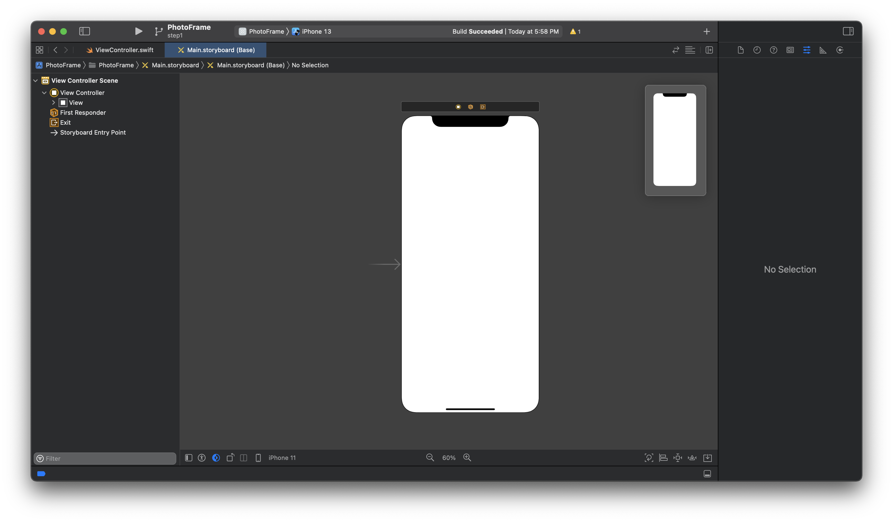
기본 스토리보드로 주어지는 Main.storyboard 에서는 UIKit에 정의된 UIViewController가 위치하여 있고, 이 ViewController의 속성 중 `isInitialViewController`가 체크되어 있다.   
이는 왼쪽에 우향 화살표를 통해 알 수 있다.
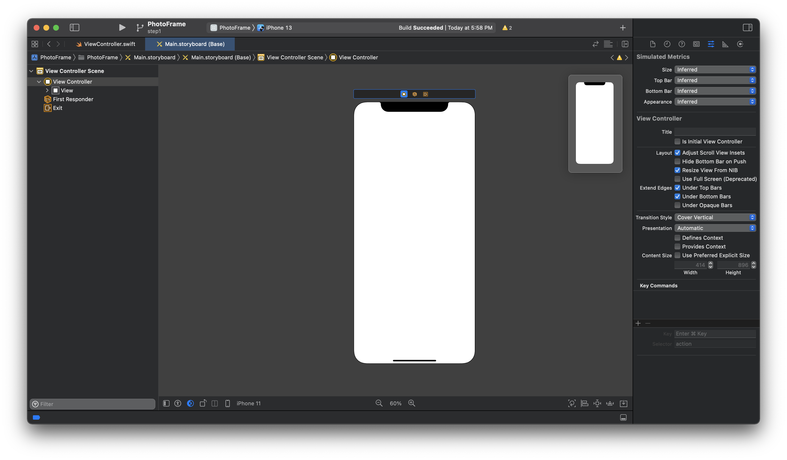

보시다시피 `isInitialViewController`의 체크를 해제하면 왼쪽 화살표가 없어진다. initialViewController가 없어진 프로젝트를 실행하면 오류가 발생한다.

과제 수행을 위해 모든 요소들을 다 제거한다. `Command`+`A`로 모두 선택하거나 드래그 앤 드롭으로 모두 선택 후 `Backspace`를 이용하여 요소들을 전부 제거한다.   
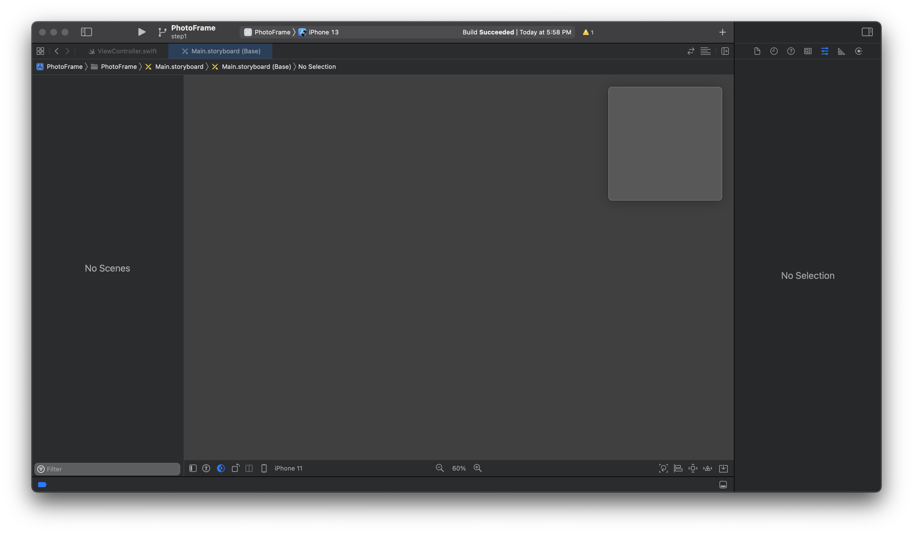   
여기서, `Command`+`Shift`+`L` 혹은 우측 상단의 `+` 버튼을 이용하여 라이브러리 창을 호출한다.   

UITabBarController 추가를 위해 TabBar 등을 입력한다. 개인적으로는 클래스 이름 그대로 적는 것을 선호한다. 이 편이 좀 더 정확한 결과를 유도하는 것 같아 선호한다.   
엔터 키를 누르거나 선택된 리스트를 그대로 드래그 앤 드롭으로 스토리보드 화면에 드롭한다.   

`isInitialViewController`가 없으므로, 맨 처음 TabBarController의 `Attribute Inspector`창을 확인한다.   
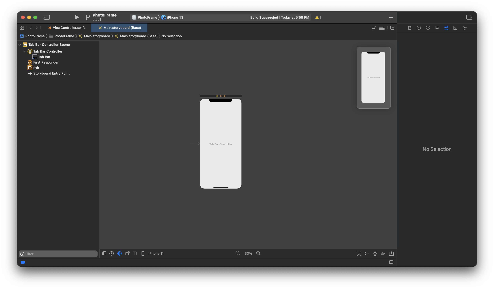
실습을 위해 미리 주어진 두 개의 뷰컨트롤러를 모두 삭제한다. 하지만, TabBarController는 남았으므로 UIViewController를 스토리보드에 추가한 뒤 새로 연결하도록 한다.   
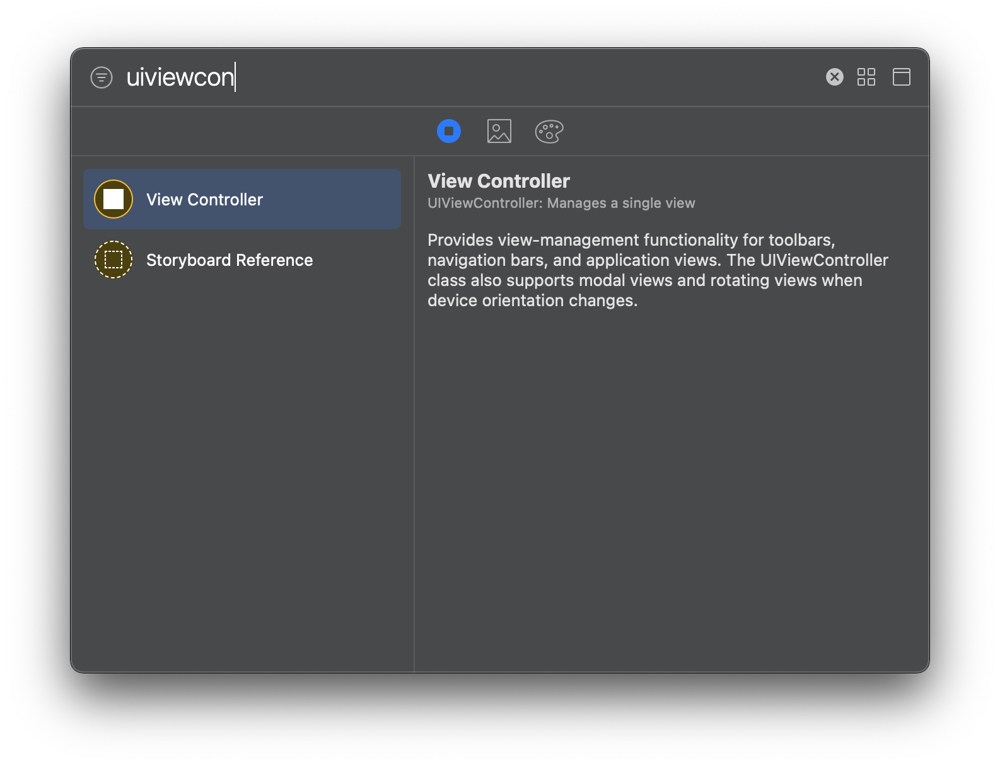
아까 UITabBarController때처럼 Library를 열어 UIViewController를 검색한다. 같은 방법으로 두 개의 UIViewController를 추가한다.   
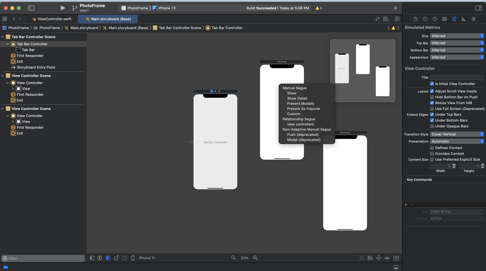
UITabBarController의 맨 위 검은 바 부분의 첫번째 버튼에서 `Control`+Drag 를 이용하여 두 개의 UIViewController를 연결한다. UITabBarController의 하위 관계이므로, `view controllers`를 선택해준다.   
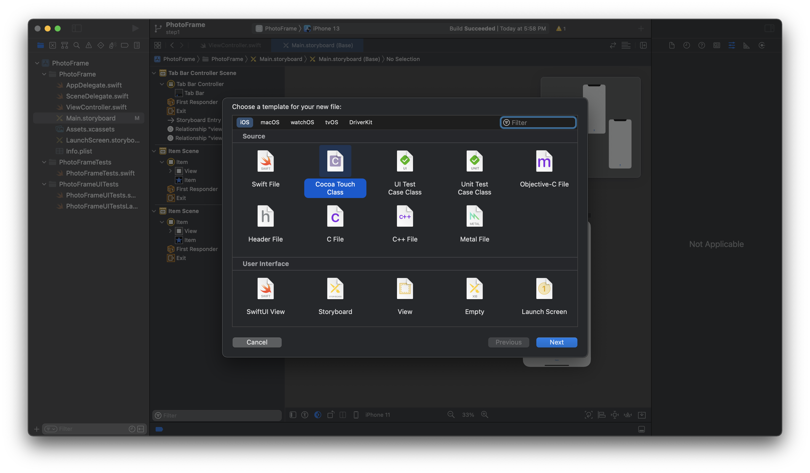
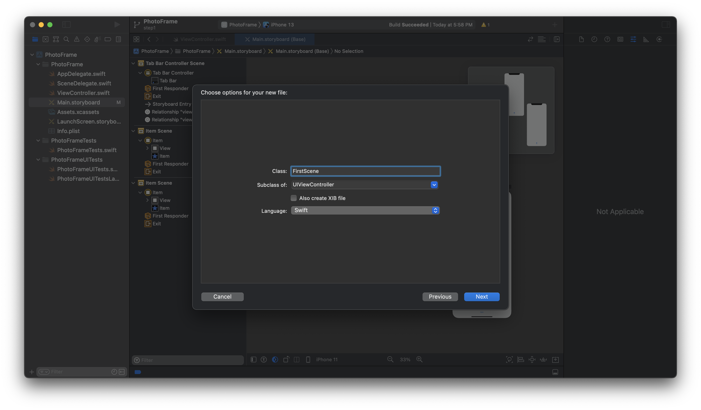
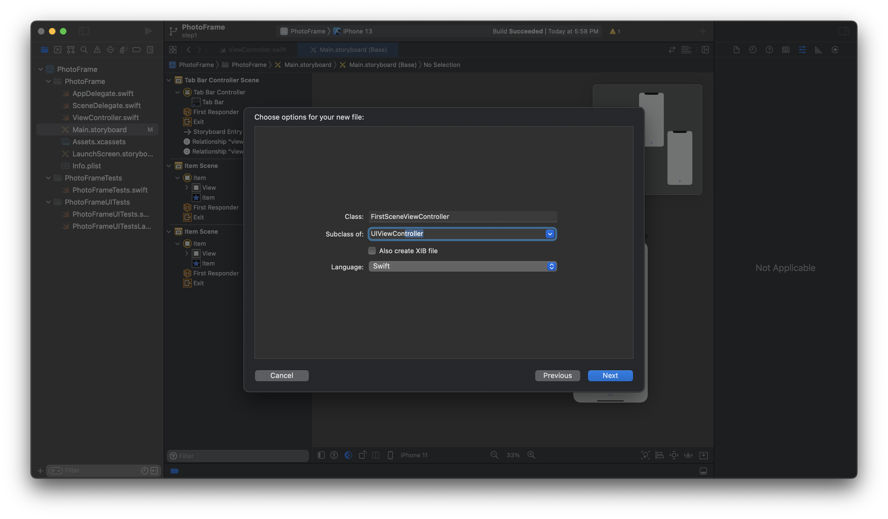
이제 첫번째 뷰컨트롤러를 위한 CustomClass를 생성한다. `Commans`+`n`을 입력하여 iOS 플랫폼의 `Cocoa Touch Class`를 찾아 Next를 클릭하거나 Enter를 입력한다.      
자동완성을 이용해본다. Class 이름은 'FirstSceneViewController'로 할 예정이다. 우선 클래스 이름을 입력하는 부분에 'FirstScene'을 입력한 후 아래 `Subclass of:` 부분에 UIViewController를 입력한다(자동완성을 지원한다).      
UIViewController가 입력되는 순간 'FirstScene' 뒤에 'ViewController'가 따라 붙는다. Next를 클릭하거나 Enter를 누르고 프로젝트 폴더 안에 클래스 코드를 담을 swift파일을 저장한다.   
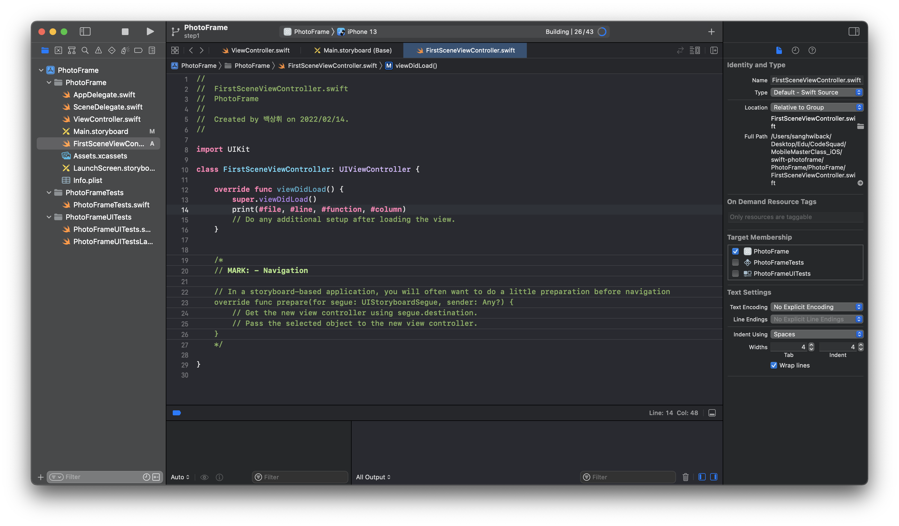
FirstSceneViewController가 바로 보이게 되었다. 주어진 코드를 입력한다.   
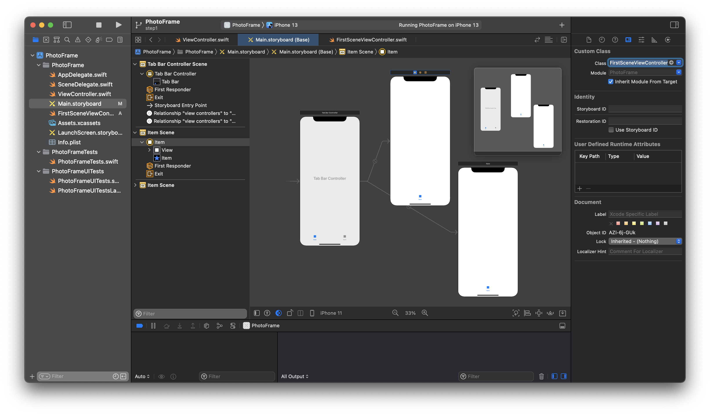
다시 스토리보드로 돌아가서 `Identity Inspector` 화면의 Custom Class 부분이 비어있다. FirstSceneViewController를 자동완성으로 입력하거나, 수동으로 입력한 후 아래의 모듈을 PhotoFrame으로 맞춘다.   
다른 뷰 컨트롤러로 갔다가 다시 돌아와 적용이 잘 되었는지 다시 확인한 후 실행해본다.   
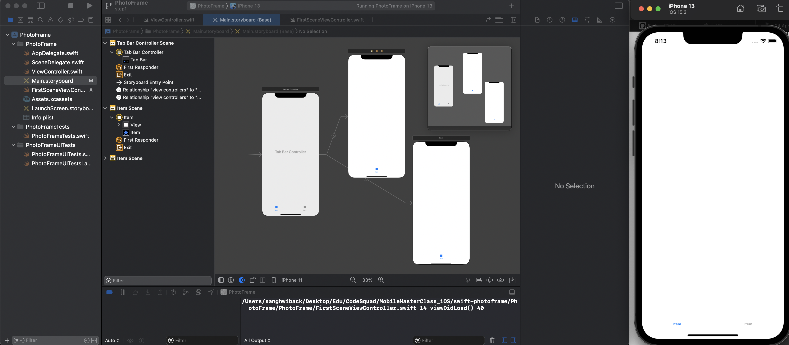
원하는 결과를 얻을 수 있었다.
